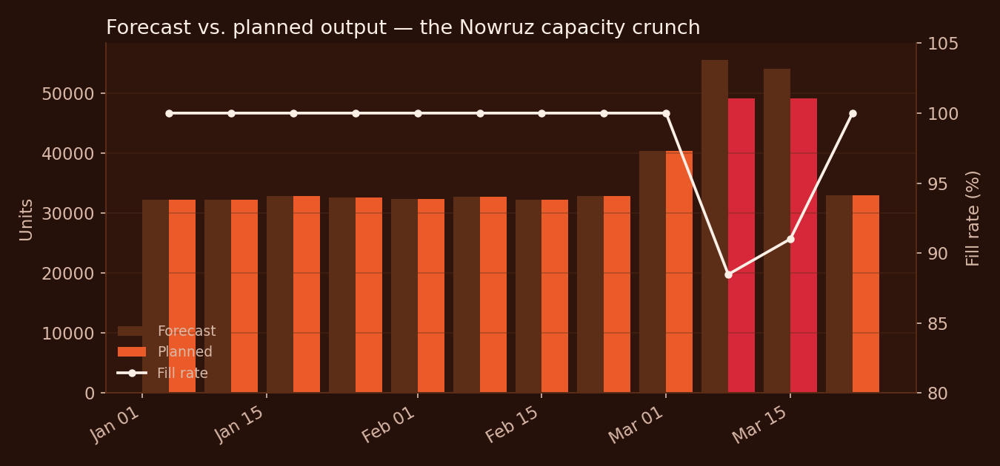
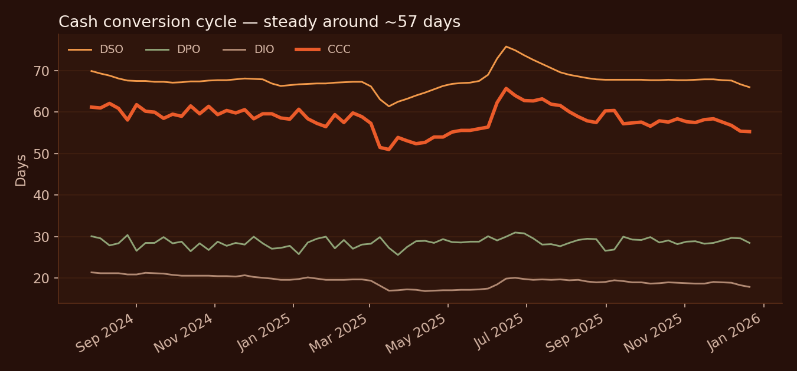
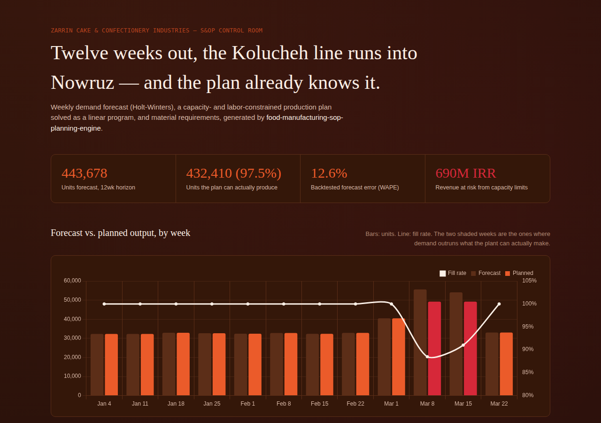

# Food Manufacturing S&OP Planning Engine

[](https://github.com/Milad-Shabani/food-manufacturing-sop-planning-engine/actions/workflows/ci.yml)


A **Sales & Operations Planning (S&OP) engine** for a fictional five-line
industrial cake, cookie, and confectionery manufacturer (~200 employees):
demand forecasting with genuine seasonality (Nowruz, Yalda Night), a
capacity- and labor-constrained production plan solved as a linear program,
a Material Requirements Plan (MRP) with purchase-order recommendations, and
a simulated **Cash Conversion Cycle (DIO / DSO / DPO)** tying it all back to
working capital — published to a SQLite warehouse + Parquet, ready for
Power BI.

Built as a portfolio implementation of the problem described in
[`docs/PROBLEM_STATEMENT.md`](docs/PROBLEM_STATEMENT.md), on a fully
synthetic dataset generated by this repo (~184K rows across 12 tables —
see [`docs/DATA_DICTIONARY.md`](docs/DATA_DICTIONARY.md)).

## Why an industrial food manufacturer, and why this is more than "forecast + multiply"

Real seasonality, not synthetic noise. **Kolucheh** — a traditional Persian
cookie — is generated with a genuine ~18-day pre-Nowruz demand build-up
(baseline ~1,000 units/day → 6,000+/day) and a sharp post-holiday drop, plus
a secondary Yalda Night spike for other items. That's what makes the
forecasting and capacity-planning problem real instead of trivial.

| Concern | How it's handled |
|---|---|
| Forecasting seasonal demand | Holt-Winters (52-week seasonal), with a seasonal-naive fallback for short histories; backtested — see results below, not just claimed |
| A line can't make everything the forecast wants | Solved as a genuine LP (`scipy.optimize.linprog`) per line/week: maximize revenue subject to **both** machine-hours (net of OEE) and labor-hours (from actual simulated attendance) |
| Which products get priority when capacity is tight | The LP's answer, not a heuristic — verified in `tests/test_planning.py` that it fully serves the higher-revenue product before the cheaper one |
| Buying the right materials at the right time | MRP explosion through a real BOM, netted against on-hand inventory, with purchase orders sized to each material's supplier lead time + safety stock |
| Recommended orders actually being useful | Orders are scheduled to *arrive* (lead-time weeks later) and credited back to projected on-hand — the material-risk numbers reflect a working reorder policy, not a balance that only ever depletes |
| How supply/production decisions hit working capital | A simulated receivables + payables ledger computes DIO/DSO/DPO/CCC as a real weekly time series, not an asserted number — see below |
| Trusting the whole thing | A quality gate on minimum fill rate + backtest WAPE fails the run loudly instead of publishing a quietly-broken plan |
| Exploring it yourself | The full synthetic dataset ships in the repo — clone and run, no external services |

## What the output actually looks like

Running the engine on the bundled dataset (forecast horizon: the 12 weeks
following the historical data, which lands squarely on the next Nowruz):



| week starting | fill rate | revenue at risk | materials below safety stock |
|---|---|---|---|
| ordinary weeks (Jan–Feb, late Mar) | 100% | — | 3–14 |
| **2026-03-08** (week before Nowruz) | **88.5%** | **~393M IRR** | 12 |
| **2026-03-15** (Nowruz week) | **91.0%** | **~297M IRR** | 16 |

The Kolucheh line genuinely can't produce everything the forecast calls
for that fortnight — and the LP responds by fully meeting demand for the
higher-margin Nowruz specialty items first, letting the lower-margin
everyday Kolucheh line absorb the shortfall. Backtested forecast accuracy:
**12.6% overall WAPE** across all 25 SKUs (8-week rolling backtest).

### Cash conversion cycle



`CCC = DIO + DSO − DPO`, simulated from real receivables/payables ledgers
(`analytics/working_capital.py`), holds steady around **~58 days**:

- **DIO ≈ 19 days** — raw materials only; finished goods barely sit in
  stock because shelf life is short, so inventory isn't where the cash is.
- **DSO ≈ 68 days** — retail chains and wholesale distributors pay slowly.
- **DPO ≈ 29 days** — perishable-ingredient suppliers (dairy, eggs) are
  paid close to cash-on-delivery; there's little float to lean on there.

The takeaway a finance team would actually act on: **the receivables gap,
not inventory, is what's tying up cash** — a very different lever to pull
than "reduce safety stock."

## Dashboard



A static, self-contained HTML dashboard (`dashboard/index.html`) renders the
pipeline's actual output — no server, no build step, works offline. Open it
directly, or enable **GitHub Pages** (Settings → Pages → Deploy from a
branch → `main` → folder `/dashboard`) to get a live link for the README /
your portfolio. It reads from `dashboard/data.js`, a plain JS file exported
straight from `planning_warehouse.db` after a pipeline run:

```bash
python -m sop_planning.cli run   # refresh data/processed/planning_warehouse.db
python scripts/export_dashboard_data.py   # regenerate dashboard/data.js
```

Re-run both any time you regenerate the dataset with a different seed —
the dashboard always reflects whatever is currently in the warehouse. The
static chart PNGs used earlier in this README (`docs/charts/`) come from
the same warehouse via a small matplotlib script:

```bash
python scripts/generate_readme_charts.py
```

## Architecture

See [`docs/ARCHITECTURE.md`](docs/ARCHITECTURE.md) for the full diagram.

```
Sales history ─► weekly aggregation ─► Holt-Winters forecast ─► capacity LP (2 constraints) ─► MRP ─► quality gate ─► SQLite + Parquet
                                             │                                                            ▲
                                             └─► rolling backtest ─► MAPE / WAPE                          │
Sales + purchase orders + inventory ─► receivables/payables ledgers ─► DIO / DSO / DPO / CCC ─────────────┘
```

## Quickstart

```bash
git clone https://github.com/Milad-Shabani/food-manufacturing-sop-planning-engine.git
cd food-manufacturing-sop-planning-engine
python -m venv .venv && source .venv/bin/activate
pip install -e ".[dev]" 2>/dev/null || { pip install -r requirements-dev.txt && pip install -e .; }

python -m sop_planning.cli run
```

The bundled `data/raw/*.csv` already contains the full 2-year synthetic
dataset, so `run` works immediately. You should see something like:

```
Forecasted 12 weeks ahead: 443,678 units demanded, 432,410 units planned
(97.5% fill rate) | cash conversion cycle ~57 days in ~10s (quality PASSED)
```

Inspect the results:

```bash
python -c "import sqlite3, pandas as pd; \
print(pd.read_sql('select * from fact_sop_weekly_summary order by week_start', sqlite3.connect('data/processed/planning_warehouse.db')).to_string(index=False))"
```

### Regenerate the dataset (different seed, size, or date range)

```bash
python -m sop_planning.cli generate-data --seed 7 --employees 250 --start 2023-01-01 --end 2024-12-31
```

### Docker

```bash
docker compose up --build planning
```

## Tests

```bash
pytest -v --cov=sop_planning
```

23 tests covering the data generator (seasonality actually spikes, BOM
references are valid, production respects line capacity), forecasting
(aggregation, horizon, backtest shape), the capacity LP (never exceeds
forecast or capacity, correctly prioritizes higher-revenue products, binds
on labor even with spare machine-hours), MRP (requirement explosion, order
recommendation + replenishment), the working-capital ledgers (balances
never go negative, CCC = DIO + DSO − DPO holds), and the quality gate.

## Data model

See [`docs/DATA_DICTIONARY.md`](docs/DATA_DICTIONARY.md). Inputs are a
standard dimensional model (`dim_employee`, `dim_production_line`,
`dim_product`, `dim_supplier`, `dim_raw_material`, `dim_region`, `bom`) plus
five fact tables; outputs (`fact_demand_forecast`, `fact_production_plan`,
`fact_material_requirements`, `fact_sop_weekly_summary`,
`fact_forecast_accuracy`, `fact_working_capital`) are written to SQLite and
Parquet, ready to plug into a Power BI model.

## Possible next steps

- Multi-line product flexibility (route a SKU to more than one line when
  its primary line is capacity-constrained) — a natural LP extension.
- Replace the fixed `operators_per_running_hour` planning assumption with
  a proper labor-productivity model calibrated from the production log.
- Feed the CCC calculation back into planning — e.g. a working-capital
  penalty term in the capacity LP alongside revenue.
- Orchestrate as a real weekly cycle (Airflow/Dagster) instead of a single
  CLI invocation, with the forecast horizon rolling forward each run.

## License

MIT — see [LICENSE](LICENSE). All data in this repository is synthetic.
