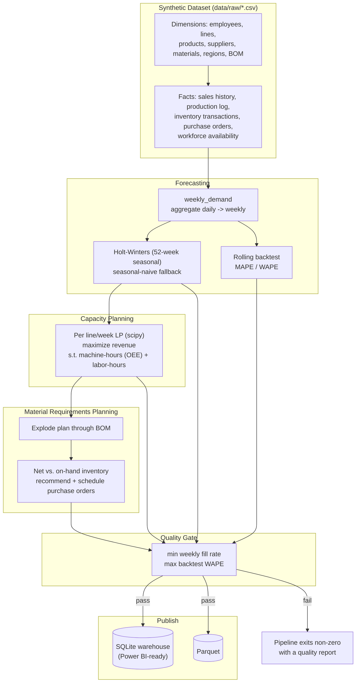

# Architecture

## Flow



## Why these choices

- **Synthetic data generation is its own module, not a one-off script.**
  `datagen/` builds dimensions, a bill of materials, and five internally
  consistent fact tables in dependency order: sales demand drives the
  production log, the production log (via the BOM) drives material
  consumption, and consumption drives a simulated reorder-point purchasing
  policy with supplier lead times and occasional late deliveries. Nothing
  is generated independently of what came before it — a material's
  consumption on a given day comes from that day's *actual* simulated
  production, not a separate random draw.

- **Seasonality is a first-class module (`datagen/seasonality.py`)**, not
  noise sprinkled on a flat baseline. Nowruz and Yalda get real
  date-anchored demand curves; a "Kolucheh" backtest genuinely has to
  handle an ~6x demand swing, which is what makes the forecasting problem
  worth solving instead of trivial.

- **Holt-Winters over a heavier model.** A 52-week seasonal
  exponential-smoothing model is enough to capture one dominant yearly
  cycle without the operational overhead of a gradient-boosted or deep
  learning forecaster — appropriate for weekly SKU-level planning at this
  scale. A seasonal-naive fallback covers any product without the ~2 years
  of history Holt-Winters needs to fit a 52-week season.

- **Two-constraint LP, not a heuristic.** The production plan is solved as
  a genuine linear program (`scipy.optimize.linprog`) with both a
  machine-hour constraint (line capacity, discounted by OEE — Overall
  Equipment Effectiveness — for realistic uptime) and a labor-hour
  constraint (from actual simulated attendance). When both are slack, every
  product gets 100% of forecast; when Nowruz-week demand exceeds what the
  Kolucheh line can physically produce, the LP is what decides which
  products get made — maximizing captured revenue rather than filling
  orders first-come-first-served.

- **MRP replenishment is simulated, not assumed away.** A recommended
  purchase order is scheduled to arrive after that material's supplier
  lead time and is credited back to the projected on-hand balance when it
  lands — so the material-risk numbers reflect a *working* reorder policy,
  not a purely depleting balance with no restocking.

- **A quality gate between planning and publish**, mirroring the same
  pattern as the sibling ETL project: a plan that can't meet a reasonable
  fill rate, or a forecast that's backtesting far worse than expected,
  fails the run loudly instead of publishing quietly-wrong numbers.

## Project layout

```
src/sop_planning/
├── config.py, logging_config.py, io_utils.py
├── pipeline.py, cli.py
├── datagen/
│   ├── dimensions.py     # employees, lines, products, suppliers, materials, regions
│   ├── bom.py             # bill of materials (category-based recipes)
│   ├── seasonality.py     # Nowruz / Yalda / Ramadan / seasonal demand curves
│   ├── facts.py           # sales, production, consumption, purchasing, workforce
│   └── build_dataset.py   # entry point: generates and writes data/raw/*.csv
├── forecasting/
│   ├── forecaster.py      # weekly aggregation + Holt-Winters / seasonal-naive
│   └── backtest.py        # rolling backtest + MAPE/WAPE
├── planning/
│   ├── capacity_lp.py     # per line/week revenue-maximizing LP
│   ├── mrp.py              # BOM explosion + inventory netting + PO recommendations
│   └── sop_report.py       # consolidated weekly S&OP summary
├── analytics/
│   └── working_capital.py  # simulated AR/AP ledgers -> DIO / DSO / DPO / CCC
├── quality/
│   └── checks.py           # fill-rate / backtest-WAPE quality gate
└── load/
    └── outputs.py           # SQLite warehouse + Parquet publish
```
